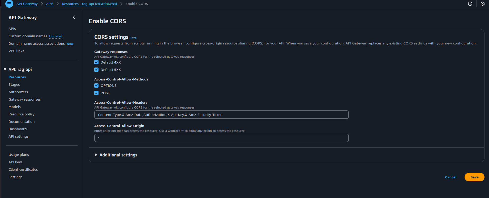

# Implement a fully managed RAG solution using Knowledge Bases for Amazon Bedrock
Retrieval-Augmented Generation (RAG) is the process of optimizing the output of a large language model, so it references an authoritative knowledge base outside of its training data sources before generating a response. Large Language Models (LLMs) are trained on vast volumes of data and use billions of parameters to generate original output for tasks like answering questions, translating languages, and completing sentences. RAG extends the already powerful capabilities of LLMs to specific domains or an organization's internal knowledge base, all without the need to retrain the model. It is a cost-effective approach to improving LLM output so it remains relevant, accurate, and useful in various contexts. Learn more about RAG [here](https://aws.amazon.com/what-is/retrieval-augmented-generation/).

[Amazon Bedrock](https://aws.amazon.com/bedrock/) is a fully managed service that offers a choice of high-performing foundation models (FMs) from leading AI companies like AI21 Labs, Anthropic, Cohere, Meta, Stability AI, and Amazon via a single API, along with a broad set of capabilities you need to build generative AI applications with security, privacy, and responsible AI. Using Amazon Bedrock, you can easily experiment with and evaluate top FMs for your use case, privately customize them with your data using techniques such as fine-tuning and RAG, and build agents that execute tasks using your enterprise systems and data sources. Since Amazon Bedrock is serverless, you don't have to manage any infrastructure, and you can securely integrate and deploy generative AI capabilities into your applications using the AWS services you are already familiar with.

[Knowledge Bases for Amazon Bedrock](https://aws.amazon.com/bedrock/knowledge-bases/) is a fully managed capability that helps you implement the entire RAG workflow from ingestion to retrieval and prompt augmentation without having to build custom integrations to data sources and manage data flows. Session context management is built in, so your app can readily support multi-turn conversations.

As part of creating a knowledge base, you configure a data source and a vector store of your choice. A data source connector allows you to connect your proprietary data to a knowledge base. Once you’ve configured a data source connector, you can sync or keep your data up to date with your knowledge base and make your data available for querying. Amazon Bedrock first splits your documents or content into manageable chunks for efficient data retrieval. The chunks are then converted to embeddings and written to a vector index (vector representation of the data), while maintaining a mapping to the original document. The vector embeddings allow the texts to be mathematically compared for similarity.

This project is implemented with two data sources; a data source for documents stored in Amazon S3 and another data source for content published on a website. A vector search collection is created in Amazon OpenSearch Serverless for vector storage. 

## Solution Architecture Diagrams
Q&A Chatbot
 

Add new websites for web datasource

- Note that with Amazon OpeSearch Serverless, you will be billed for [4 OCUs at a minimum](https://aws.amazon.com/opensearch-service/pricing/#Amazon_OpenSearch_Serverless) at all times. Follow instructions in the [Cleanup](#cleanup) section to avoid charges.

## Deploy solution

### Prerequisite
- Install and configure [AWS CLI](https://aws.amazon.com/cli/)
- Install and bootstrap [AWS CDK](https://aws.amazon.com/cdk/)
- Pick a region from the Amazon Bedrock [Supported Regions](https://docs.aws.amazon.com/bedrock/latest/userguide/bedrock-regions.html)

### Backend
- Clone this repository to your local computer. 
- From the backend folder, run "npm install" to install all dependencies. Use "npm audit" to check for known vulnerabilites on the dependent packages.
- Use CDK to deploy the backend to AWS. For example,
```
cdk deploy"
```

When the deployment completes,
- Make note of the API Gateway URL shown at BackendStack.APIGatewayUrl output.
- Make note of the S3 bucket name shown at BackendStack.DocsBucketName output.
- **API Gateway URL**: This will be automatically written to `frontend/src/config.json`.
- **S3 Bucket Name**: Use this bucket name to upload documents for ingestion.

---

### Amazon Bedrock foundational model
This solution allows users to select which foundational model they want to use during the retrieval and generation phase. The default model is **Anthropic Claude Instant**. For the knowledge base embedding model, this solution uses **Amazon Titan Embeddings G1 - Text** model. Make sure you have [access to these foundation models](https://docs.aws.amazon.com/bedrock/latest/userguide/model-access.html).

### Upload content to S3 bucket

1. Upload documents (e.g., annual reports) to the S3 bucket created during deployment:
   - Example: Upload [Amazon's 2022 Annual Report](https://s2.q4cdn.com/299287126/files/doc_financials/2023/ar/Amazon-2022-Annual-Report.pdf).
   - Use the [AWS S3 Console](https://docs.aws.amazon.com/AmazonS3/latest/userguide/upload-objects.html) or CLI:
     ```bash
     aws s3 cp <file-path> s3://<bucket-name> --region <region>
     ```
2. The content will automatically synchronize with the knowledge base.

---

### Syncing Data Source in Bedrock
1. Navigate to the **Amazon Bedrock Console**.
2. Go to **Knowledge Bases** under **Building Tools**.
3. Select your knowledge base (e.g., `KBBackendStacowledgeBase80E07476`).
4. For S3 data sources (e.g., `doc`), synchronization happens automatically.
5. For web crawlers (`WebCrawlerDataSource`), manually sync by selecting it and clicking **Sync**.

### Synchronize Web Content
1. The deployed solution initializes a web data source (`WebCrawlerDataSource`) with the URL `https://www.aboutamazon.com/news/amazon-offices`.
2. To sync this data source:
   - Go to the Bedrock console > Knowledge Bases > Data Sources.
   - Select `WebCrawlerDataSource` and click **Sync**.
3. Refer to [Sync your data source with Amazon Bedrock Knowledge Base](https://docs.aws.amazon.com/bedrock/latest/userguide/knowledge-base-ingest.html) for more details.

---

### Knowledge Ingestion (RAG)
Screenshot showing how knowledge was ingested into Amazon Bedrock, including:
1. Uploaded documents in S3.
2. Synced data sources in Bedrock.


---

### Enabling API Gateway CORS
1. Navigate to the **API Gateway Console**.
2. Select your API (e.g., `rag-api`) and go to **Resources**.
3. For each endpoint (`/`, `/docs`, `/urls`, `/web-urls`):
   - Click on **Enable CORS**.
   - Check all methods (OPTIONS, POST, GET) and save changes.
4. Redeploy the API Gateway after enabling CORS.


---

### Frontend Deployment

1. Navigate to the frontend folder:
   ```bash
   cd frontend
   ```
2. Install dependencies:
   ```bash
   npm install
   ```
3. You must copy the API gateway url that deployed in backend folder and paste that in `config.json` file to update the apiBaseUrl.
   ```json
   "apiBaseUrl": "https://co3rdniw8a.execute-api.us-east-1.amazonaws.com/prod/"
   ```
   Because the CDK can't pass the token value to outside of the file before deployment.

4. Start the frontend application:
   ```bash
   npm start
   ```
5. Open your browser at `http://localhost:3000`. The application will:
   - Automatically load the API Gateway URL from `config.json`.

6. Follow these steps in the UI:
   1. Step 1: Verify that the API Gateway URL is pre-filled in "Input your base URL here."
   2. Step 2: Select a model (e.g., `Anthropic Claude Instant` or `Amazon Titan Text Premier`).
   3. Step 3: Enter a question (e.g., "What was Amazon's growth in 2022?") and view responses.

---

### Chatbot Interaction
Screenshot showing chatbot interaction with a question entered, response generated, and citation displayed.


---

## Cleanup
Use "cdk destroy" to delete the stack of cloud resources created in this solution deployment.

## Security checks
- npm audit is used to confirm there are no vulnerabilities.
- SonarLint is used in VS Code to confirm there are no problems detected in the codebase.
- [Amazon Q Developer](https://docs.aws.amazon.com/amazonq/latest/qdeveloper-ug/security-scans.html) project scan is run to confirm there are no vulnerabilities in the codebase.
- S3 bucket created in this project is setup to enforce ssl requests only and encrypt data at rest.
- S3 bucket is setup to block public access.
- API Gateway is setup with AWS Web Application Firewall to allow requests from a specific IP address only.
